# Hartman Lab Server Manual

## First-time login

1. Obtain your username and temporary password from an admin.
2. Change your temporary password.
    * Login via [`ssh`](#ssh-remote-login): **`ssh username@hartmanlab.genetics.uab.edu`**
    * Set a new password when prompted — you will be logged out automatically.
3. Change your temporary samba password.
    * Login via [`ssh`](#ssh-remote-login): **`ssh username@hartmanlab.genetics.uab.edu`**
    * Change your `samba` password (default: *same temporary password*): `smbpasswd`
4. *Optional*: Set up key-based authentication for faster, more secure logins:

    ```bash
    ssh-keygen -t rsa -b 4096 -f ~/.ssh/id_rsa_4096
    ssh-copy-id -i ~/.ssh/id_rsa_4096.pub username@hartmanlab.genetics.uab.edu
    ```
5. Read the `ssh` login message for server status updates. See [Troubleshooting](#troubleshooting) and [GitHub Resources](#github-resources) for help.

## `x2goclient` remote desktop

Connect to a persistent remote desktop using [`x2goclient`](https://wiki.x2go.org/doku.php/download:start) (Linux/Windows/OSX).

Sessions can be paused or suspended from the client window. Create multiple sessions with different quality settings for different network conditions.

### `x2goclient` configuration

* **Session tab**
  * Session name: Hartman Lab Server
  * Host: `hartmanlab.genetics.uab.edu`
  * Login: *`username`*
  * SSH port: `22`
  * Session type: **[MATE](https://mate-desktop.org/)** (provides the best experience with X2Go)
  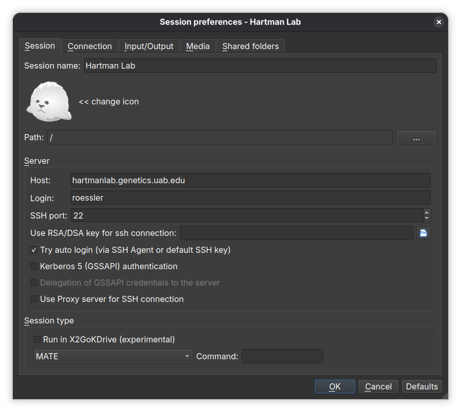

* **Connection tab**
  * Set connection speed to **LAN** (on-campus) or **WAN** (off-campus); leave compression as *adaptive*.
* **Input/output tab**
  * If automatic resizing fails (common on HiDPI), set a manual startup resolution. For scaling issues, try DPI 96.
  * For keyboard mapping issues (e.g., broken arrow keys), select *Configure Keyboard* and keep the defaults.
* **Media tab**
  * Disable sound support to prevent pulseaudio log spam.
* **Shared folders tab**
  * Browse to a folder, add it to the share, and select *automount*. Shared folders appear at `/media/disk/<share_name>`.
    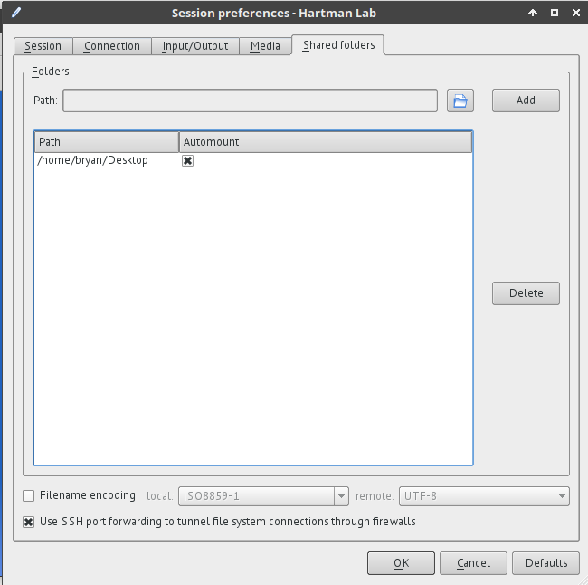

## `ssh` remote login

* Linux/OSX: **`ssh username@hartmanlab.genetics.uab.edu`**
* Windows: [PuTTY](http://www.chiark.greenend.org.uk/~sgtatham/putty/download.html)
* Android: [JuiceSSH](https://juicessh.com/) or [Termux](https://termux.dev/)

### `ssh` X forwarding

Run graphical programs on the server with local display output.

* Linux/OSX: `ssh -X username@hartmanlab.genetics.uab.edu`
* Windows: Install [Xming](http://www.straightrunning.com/XmingNotes/) and enable X11 forwarding in [PuTTY](http://www.chiark.greenend.org.uk/~sgtatham/putty/download.html) options.

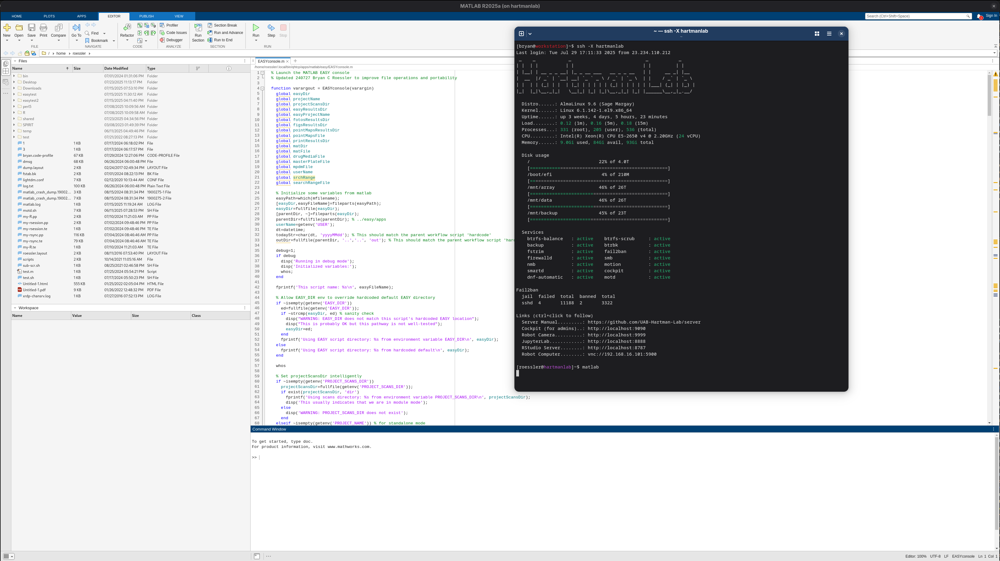

## `sftp` remote filesharing

* File manager (*Caja*): enter `sftp://username@hartmanlab.genetics.uab.edu/home/username` in the URL bar

  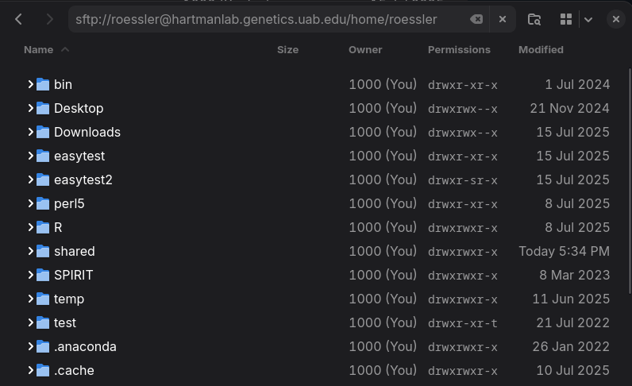
* [Filezilla](https://filezilla-project.org/download.php?type=client) (Linux/OSX/Windows)

  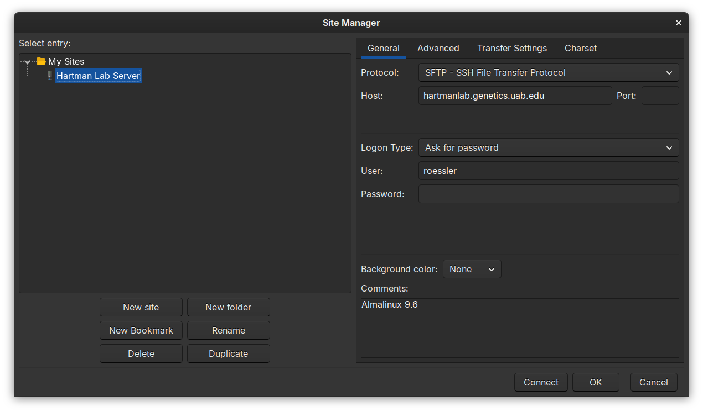
* [sshfs](https://www.digitalocean.com/community/tutorials/how-to-use-sshfs-to-mount-remote-file-systems-over-ssh) (Linux/OSX/Windows)
* [WinSCP](https://winscp.net/eng/index.php) (Windows)

## `samba` remote filesharing

The server provides two `samba` shares (credentials: server username/password):

1. Shared data array (`/mnt/data`): `\\username\\data`
2. User home directory (`/home/username`): `\\username\\username`

**Note:** Samba shares are only available on-campus. For off-campus access, use SSH tunneling: `ssh -L 1445:localhost:445 user@remote-server`

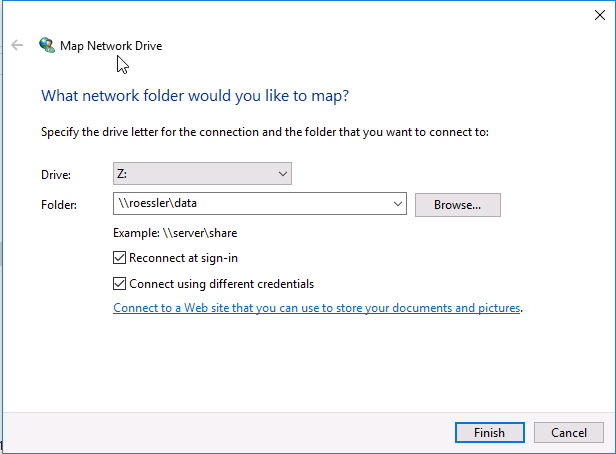

## Robot computer remote desktop

* In X2Go, open *Applications > Internet > Remote Viewer*, enter [`vnc://robot:5900`](vnc://robot:5900) in *Connection Address*, and click Connect.

  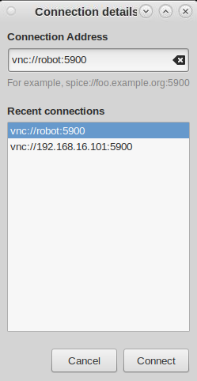

## Robot computer remote filesharing

* In X2Go, open *Applications > System Tools > Caja*, enter [`ftp://robot`](ftp://robot) in the Location bar, and hit *Enter*. Open a second Caja window to drag-and-drop or copy-paste projects to the shared data array.

  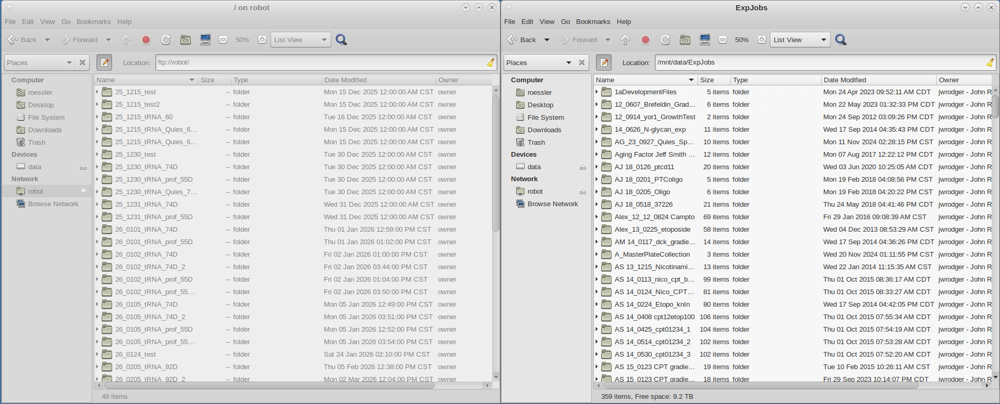

## Robot webcam

* In an X2Go session, via a web browser at [`http://localhost:9999`](http://localhost:9999)
* Locally via a web browser via an SSH tunnel: `ssh -f username@hartmanlab.genetics.uab.edu -L 9999:localhost:9999 -N`

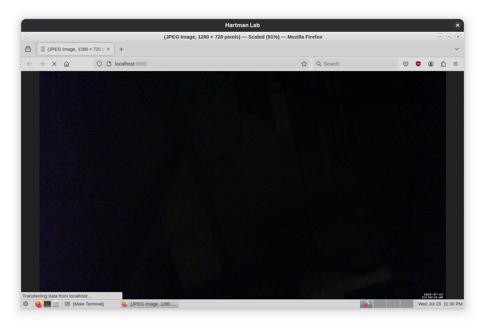

## RStudio Server

* In an X2Go session, via a web browser at [`http://localhost:8787`](http://localhost:8787)
* Locally via a web browser via an SSH tunnel: `ssh -f username@hartmanlab.genetics.uab.edu -L 8787:localhost:8787 -N`

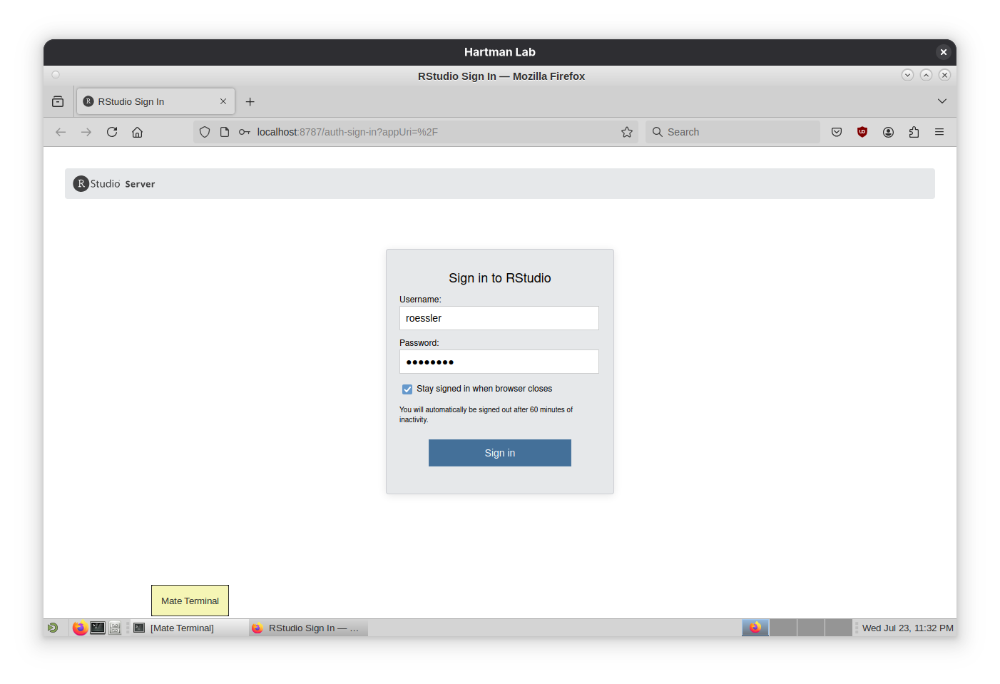
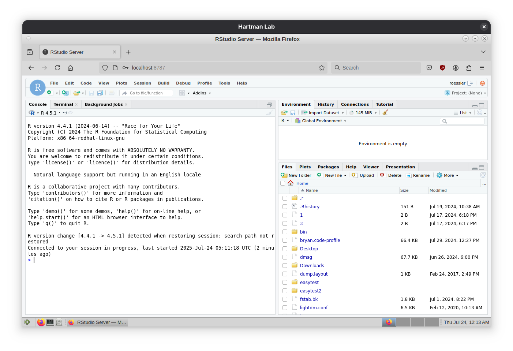

## Other available software

* [VSCode](https://code.visualstudio.com/)
* [MATLAB](https://www.mathworks.com/help/matlab/index.html)
* [Jupyter Notebook](https://jupyter.org/)
* [`qhtcp-workflow`](https://github.com/UAB-Hartman-Lab/qhtcp)
* [`podman`](https://podman.io/) for containers
* [`toolbox`](https://docs.fedoraproject.org/en-US/fedora-silverblue/toolbox/) for custom software
* [`distrobox`](https://github.com/89luca89/distrobox) for custom environments
* ...and much more (see `dnf list --installed` for installed packages). [Open an issue](https://github.com/UAB-Hartman-Lab/server/issues) for missing or out-of-date software.

## Backing up data

`/mnt/data` is snapshotted daily to `/mnt/backup/data-backup` and rolling backups are retained for six months.

[`rsync`](https://linux.die.net/man/1/rsync) is recommended for periodically backing up user files to a local client.

* Copy a user's `$HOME` directory locally to `/home-backup` from a client: `rsync -azH --delete username@hartmanlab.genetics.uab.edu:/home/username/ home-backup/`
* Copy a shared directory locally to the current directory from a client: `rsync -azh username@hartmanlab.genetics.uab.edu:/mnt/data/scans/20250723_roessler_project .`

Backups can also be run from the server using pre-installed tools (`rsnapshot`, `borgbackup`, ...).

## Troubleshooting

Read the `ssh` login message (`cat /etc/motd`) for server status and updates. [Open an issue](https://github.com/UAB-Hartman-Lab/server/issues) if there is one.

* Can't login via `ssh`
  * Verify your username and that caps lock is off.
  * Three consecutive failed logins from off-campus will ban the IP for one hour.
  * Have an admin run: `sudo script-user-unban <ip_address>`
  * Have an admin run: `sudo script-user-reset-password <username>`
* Can't login via X2Go
  * Login via `ssh` and reset corrupt X2Go sessions: `script-user-reset-x2go`
* X2Go desktop is corrupted (desktop not similar to [screenshot](#x2goclient-remote-desktop))
  * Login via ssh and reset your desktop: `script-user-reset-desktop`
* File permissions issues
  * Check permissions with `ls -al` or your file manager.
  * `/mnt/data` uses shared group permissions, usually:
    * Group: `smbgrp`
    * User: *username* that created/owns the file (or `smbgrp`)
    * Permissions: `2775`
  * To change: `chown -R username:smbgrp <dir> && chmod 2775 <dir>`
  * If you lack the necessary privileges, ask an admin to fix permissions or make a copy.
* Program runs slowly in paused X2Go session
  * Run program via `ssh` in a [`tmux`](https://en.wikipedia.org/wiki/Tmux) or [`screen`](https://www.gnu.org/software/screen/) session instead.

## GitHub Resources

* [Issues](https://github.com/UAB-Hartman-Lab/server/issues)
* [Wiki](https://github.com/UAB-Hartman-Lab/server/wiki)
* [Chat](https://github.com/UAB-Hartman-Lab/server/discussions)

## External Resources

* [RHEL documentation](https://access.redhat.com/documentation/en/red-hat-enterprise-linux/)
* [Navigating the Linux CLI](https://www.digitalocean.com/community/tutorials/basic-linux-navigation-and-file-management)
* [Explainshell](https://explainshell.com/)
* [UAB Cheaha](https://docs.uabgrid.uab.edu/wiki/Cheaha_GettingStarted)

## Platform

* AlmaLinux 9.6 w/ Linux 6.1 LTS Hyperscale SIG kernel
* Intel Xeon X99 E5-2650v4 12-core CPU
* 96GB DDR4 RAM
* 4TB PCIe 3.0 NVMe SSD: `/`, `/home`
* 20TB `btrfs` raid1 array: `/mnt/data`
* 20TB `btrfs` raid1 backup array: `/mnt/backup`

## Administrators

For additional documentation see [`docs/README.md`](docs/README.md).
