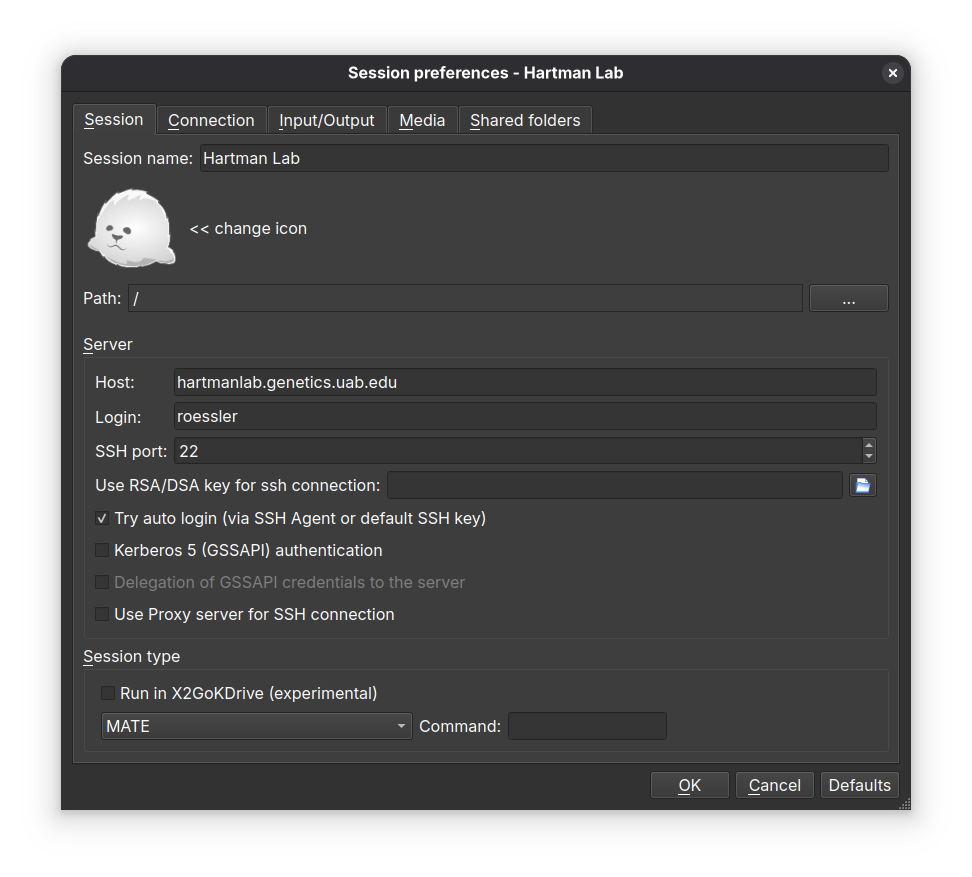

# Hartman Lab Server Manual

## First-time login

1. Ensure an admin has enabled your user account and provided a username.
2. Login via [`ssh`](#ssh): `ssh username@hartmanlab.genetics.uab.edu` (default password is your *username*)
3. You will be prompted to create a new password and then logged out
4. Login again using your new password: `ssh username@hartmanlab.genetics.uab.edu`
5. Change the default `samba` password (default password is also your *username*): `smbpasswd`
6. *Optional*: Generate a public-private keypair on your client and copy it to the server for faster and more secure logins.

    ```bash
    ssh-keygen -t rsa -b 4096 -f ~/.ssh/id_rsa_4096
    ssh-copy-id -i ~/.ssh/id_rsa_4096.pub username@hartmanlab.genetics.uab.edu
    ```

## `ssh`

Connect to the server remotely using the command line.

* Linux/OSX
  * `ssh username@hartmanlab.genetics.uab.edu`
* Windows
  * [PuTTY](http://www.chiark.greenend.org.uk/~sgtatham/putty/download.html)
* Android
  * [JuiceSSH](https://juicessh.com/)
  * [Termux](https://termux.dev/)

### X forwarding

Launch graphical server programs locally on a client that execute on the server.

* Linux/OSX
  * Enable X forwarding during ssh login: `ssh -X username@hartmanlab.genetics.uab.edu`
* Windows
  * Install [Xming](http://www.straightrunning.com/XmingNotes/) and enable X11 forwarding in the [PuTTY](http://www.chiark.greenend.org.uk/~sgtatham/putty/download.html) options.

## `sftp`

Browse and manage files stored on the server.

* Native access to sftp shares using client file manager (`sftp://username@hartmanlab.genetics.uab.edu:/home/username`):
  
* Linux/OSX/Windows
  * [Filezilla](https://filezilla-project.org/download.php?type=client)

    
  * [sshfs](https://www.digitalocean.com/community/tutorials/how-to-use-sshfs-to-mount-remote-file-systems-over-ssh)
* Windows
  * [WinSCP](https://winscp.net/eng/index.php)

## `samba`

Mount `samba` file shares on any platform as if the server data was on a local drive.

The server provides two `samba` shares:

1. Shared data array (`/mnt/data`): `\\username\\data`
2. User's `$HOME` directory: `\\username\\username`

The default `samba` credentials are the same as your server username and password. Users can change their `samba` password using `smbpasswd`.

## `x2goclient`


Access an X2Go remote desktop session using the X2Go `x2goclient` available for Linux/OSX/Windows from the [X2Go website](http://wiki.x2go.org/doku.php) or by installing the `x2goclient` package.

X2Go sessions can be paused or suspended from the X2Go client window. Multiple sessions can be created on the client, making it possible to select alternate quality settings based on location and bandwidth.



* Session tab
  * Session name: Hartman Lab Server
  * Host: `hartmanlab.genetics.uab.edu`
  * Login: *`username`*
  * SSH port: `22`
  * Session type: **MATE** (MATE provides the best experience with X2Go)
* Connection tab
  * Set the connection speed to LAN when connecting from within the UAB network and WAN when outside of the UAB network
  * Compression settings should be left unchanged or set to *adaptive*.
* Input/output tab
  * If automatic window resizing is not working properly (common on HiDPI monitors), set the desired startup window resolution size manually. For full screen sessions, this should match your client display. In case of scaling issues, play with the DPI setting, 96 is a sane starting value.
  * If there are any issues with keyboard mapping (ex. the arrow keys are not working), select *Configure Keyboard* and leave the default selected settings.
* Media tab
  * Disable sound support. This will prevent pulseaudio from spamming the server logs.
* Shared folders tab
  * Select folders on the client to be shared with the server during a session. Browse to the chosen folder, add it to the share, and select *automount*.
  * These folders will then appear on the server under `/media/disk/<share_name>`.
    

**Note:** Some programs do not continue to run at full speed when an X2Go session is paused. In these cases, the program should be run via `ssh` in a [`tmux`](https://en.wikipedia.org/wiki/Tmux) or [`screen`](https://www.gnu.org/software/screen/) session.

## Robot computer remote desktop access

In an X2Go session, go to *Applications>Internet>Remote Viewer>Connection>New* and enter [`vnc://192.168.16.101:5900`](vnc://192.168.16.101:5900)

## Webcam robot monitoring

* In an X2Go session, via a web browser at [`http://localhost:9999`](http://localhost:9999)
* Locally via a web browser via an SSH tunnel: `ssh -f username@hartmanlab.genetics.uab.edu -L 9999:localhost:9999 -N`

## RStudio Server

* In an X2Go session, via a web browser at [`http://localhost:8787`](http://localhost:8787)
* Locally via a web browser via an SSH tunnel: `ssh -f username@hartmanlab.genetics.uab.edu -L 8787:localhost:8787 -N`

## JupyterLab (Python) IDE

* In an X2Go session, via a web browser at [`http://localhost:8888`](http://localhost:8888)
* Locally via a web browser via an SSH tunnel: `ssh -f username@hartmanlab.genetics.uab.edu -L 8888:localhost:8888 -N`

## Data backup

[`rsync`](https://linux.die.net/man/1/rsync) is recommended for periodically backing up user files to a local client.

* Copy a user's `$HOME`' directory locally to `/home-backup`: `rsync -azH --delete username@hartmanlab.genetics.uab.edu:/home/username/ home-backup/`
* Copy a shared directory locally `rsync -azh username@hartmanlab.genetics.uab.edu:/mnt/data/scans/20250723_roessler_project .`

## Troubleshooting

* Reset your X2Go sessions: `script-user-reset-x2go`
* Reset your X2Go desktop: `script-user-reset-desktop`
* Change your user login password: `passwd`
* Change your samba password: `smbpasswd`
* Read the `motd` for service statuses and updates: `cat /etc/motd`

## Resources

* [RHEL documentation](https://access.redhat.com/documentation/en/red-hat-enterprise-linux/)
* [Navigating the Linux CLI](https://www.digitalocean.com/community/tutorials/basic-linux-navigation-and-file-management)
* [Explainshell](https://explainshell.com/)
* [UAB Cheaha](https://docs.uabgrid.uab.edu/wiki/Cheaha_GettingStarted)

## Platform

* AlmaLinux 9.6 w/ Linux 6.1 LTS Hyperscale SIG kernel
* Intel Xeon X99 E5-2650v4 12-core CPU
* 96GB DDR4 RAM
* 4TB PCIe 3.0 NVMe SSD: `/`, `/home`
* 20TB btrfs raid1 array: `/mnt/data`
* 20TB btrfs raid1 backup array: `/mnt/backup`

## Administrators

See additional documentation in [`docs/README.md`](docs/README.md).
